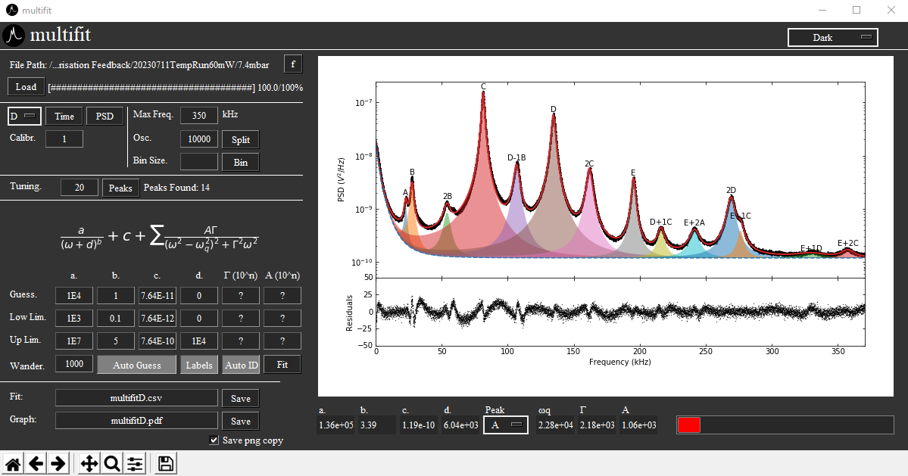

# multi-fit
multi-fit is a general tool that seeks to automatically detect peaks and fit to them on PSD data, derived from trapped levitating nanoparticles. The goal of this project is to allow fitting on a broad range of data input types and levitation schemes i.e. optical and electrical.

## Planned Features
1. Ability to change the form of the fitting function. JP
2. Compatibility with more types of input data (especially .csv). JP
3. More multithreading, to make the application more responsive. JK
4. Label toggle JS
5. Autolabel toggle JS
6. Default save names JS
8. Multithread all buttons JK
9. Quit button JK
10. Make Amp guess more transparent (more info in README) JK
11. Clear button for extra peaks JK
12. Calibration input JK

> **Note**
> Suggestions are highly encouraged!
