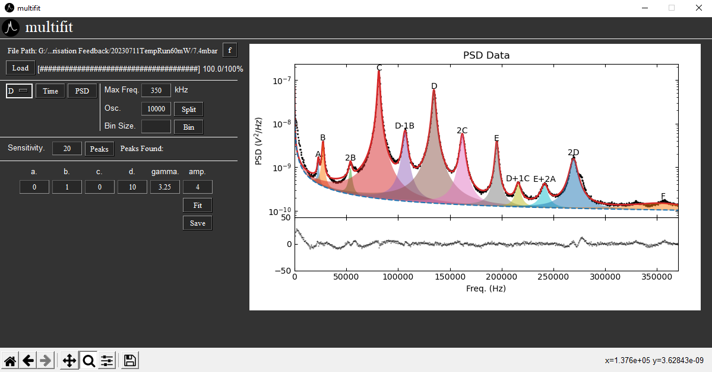

# multi-fit
multi-fit is a general tool that seeks to automatically detect peaks and fit to them on PSD data, derived from trapped levitating nanoparticles. The goal of this project is to allow fitting on a broad range of data input types and levitation schemes i.e. optical and electrical.

